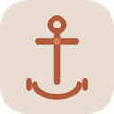

<a id="readme-top"></a>

[![Contributors][contributors-shield]][contributors-url]
[![Forks][forks-shield]][forks-url]
[![Stargazers][stars-shield]][stars-url]
[![Issues][issues-shield]][issues-url]
[![MIT License][license-shield]][license-url]


<!-- PROJECT LOGO -->
<br />
<div align="center">
  <a href="https://github.com/KrushedKnight/Anchor">
    
  </a>

<h3 align="center">Anchor</h3>

  <p align="center">
    A local-only macOS app that monitors your behavior during focus sessions, detects distraction in real-time, and nudges you back on track.
    <br />
    <br />
    <a href="#"><strong>Website (Coming Soon)</strong></a>
    <br />
    <a href="https://github.com/KrushedKnight/Anchor/issues/new?labels=bug&template=bug-report---.md">Report Bug</a>
    &middot;
    <a href="https://github.com/KrushedKnight/Anchor/issues/new?labels=enhancement&template=feature-request---.md">Request Feature</a>
  </p>
</div>


<!-- TABLE OF CONTENTS -->
<details>
  <summary>Table of Contents</summary>
  <ol>
    <li>
      <a href="#about-the-project">About The Project</a>
      <ul>
        <li><a href="#how-it-works">How It Works</a></li>
        <li><a href="#built-with">Built With</a></li>
      </ul>
    </li>
    <li>
      <a href="#getting-started">Getting Started</a>
      <ul>
        <li><a href="#prerequisites">Prerequisites</a></li>
        <li><a href="#installation">Installation</a></li>
        <li><a href="#permissions">Permissions</a></li>
      </ul>
    </li>
    <li><a href="#usage">Usage</a></li>
    <li><a href="#architecture">Architecture</a></li>
    <li><a href="#roadmap">Roadmap</a></li>
    <li><a href="#contributing">Contributing</a></li>
    <li><a href="#license">License</a></li>
    <li><a href="#contact">Contact</a></li>
    <li><a href="#acknowledgments">Acknowledgments</a></li>
  </ol>
</details>


<!-- ABOUT THE PROJECT -->
## About The Project

<!-- [![Anchor Screenshot][product-screenshot]](https://github.com/KrushedKnight/Anchor) -->

Most productivity tools just block websites. Anchor takes a different approach — it **watches how you work** and intervenes only when you're actually drifting.

It tracks your foreground apps, browser tabs, idle state, and window titles to build a real-time picture of your focus quality. When it detects you're slipping — bouncing between apps, lingering on Twitter, passively scrolling — it sends escalating nudges to pull you back.

**Key features:**
- **Real-time focus scoring** — continuously evaluates your work state (deep focus, productive switching, novelty seeking, passive drift, etc.)
- **Smart distraction detection** — tracks app switching rates, browser domain hopping, idle time, and off-task dwell with compound signal analysis
- **AI-powered task classification** — optionally uses Anthropic, OpenAI, or local Ollama models to classify apps/domains as on-task or off-task for your specific session
- **Works without AI too** — ships with 100+ built-in heuristic rules for common apps and domains
- **Escalating interventions** — gentle nudges that get firmer the longer you stay off-task, with smart cooldowns and recovery detection
- **Pomodoro & freeform modes** — structured timed sessions or flexible open-ended focus blocks with manual breaks
- **Adaptive learning** — builds a user profile over time and tunes thresholds to your work style
- **Session analytics** — post-session summaries and historical analytics to track your focus trends
- **100% local** — all data stays on your machine. No accounts, no telemetry, no cloud sync.

> This is a personal project I built as a student to solve my own focus problems. I'm open-sourcing it because I think others might find it useful too.

<p align="right">(<a href="#readme-top">back to top</a>)</p>


### How It Works

```
Observers → EventStore → BehaviorAnalyzer → DriftEngine → InterventionEngine → Notifications
```

1. **Observers** monitor your foreground app, browser tabs, idle state, and window titles
2. **EventStore** buffers events in a ring buffer (10k max)
3. **BehaviorAnalyzer** consumes events and builds behavioral snapshots (switch rates, dwell times, bouncing patterns)
4. **DriftEngine** ticks every 2 seconds, classifying your work state and computing a focus score (0–1)
5. **InterventionEngine** applies cooldowns and escalation logic, sending nudges via macOS notifications when you drift

The engine doesn't just look at what app you're in — it tracks **how** you're using it. Rapidly bouncing between apps? That's `stuckCycling`. Lingering on Reddit? That's `passiveDrift`. A quick glance at Discord then back to Xcode? That's fine.

<p align="right">(<a href="#readme-top">back to top</a>)</p>


### Built With

* [![Swift][Swift-badge]][Swift-url]
* [![SwiftUI][SwiftUI-badge]][SwiftUI-url]
* [![Xcode][Xcode-badge]][Xcode-url]

<p align="right">(<a href="#readme-top">back to top</a>)</p>


<!-- GETTING STARTED -->
## Getting Started

### Prerequisites

- macOS 15.0 or later
- Xcode 16.0 or later

### Installation

1. Clone the repo
   ```sh
   git clone https://github.com/KrushedKnight/Anchor.git
   ```
2. Open the project in Xcode
   ```sh
   cd Anchor
   open Anchor.xcodeproj
   ```
3. Build and run (`Cmd + R`)

No external dependencies, no package managers, no configuration files. Just clone and build.

### Permissions

Anchor needs a few macOS permissions to function — it asks on first launch:

| Permission | Why |
|---|---|
| **Accessibility** | Reading window titles via the Accessibility API |
| **Automation (Chrome)** | Reading the active tab URL from Chrome via AppleScript |
| **Notifications** | Delivering focus nudges |

> Anchor's App Sandbox is disabled because `CGEventSource` (idle detection) and the Accessibility API require it. All data stays local.

<p align="right">(<a href="#readme-top">back to top</a>)</p>


<!-- USAGE -->
## Usage

1. **Start a session** — give it a task name (e.g., "Finish the auth module") and optionally mark specific apps/domains as on-task or off-task
2. **Work normally** — Anchor watches silently, scoring your focus in the floating widget
3. **Get nudged** — if you drift, you'll get a gentle notification that escalates if you stay off-task
4. **Review your session** — when you end the session, you'll see a summary of your focus score, time on-task, distractions, and more

**Modes:**
- **Freeform** — open-ended session, take manual breaks whenever
- **Pomodoro** — timed work/break cycles (configurable durations)

**AI classification (optional):**

Go to Settings → API and add a key for Anthropic, OpenAI, or configure a local Ollama instance. The app will then classify unfamiliar apps and domains for your specific task context. Without AI, it falls back to 100+ built-in heuristic rules.

<p align="right">(<a href="#readme-top">back to top</a>)</p>


<!-- ARCHITECTURE -->
## Architecture

### Data Flow

```
┌─────────────┐     ┌────────────┐     ┌──────────────────┐     ┌─────────────┐     ┌────────────────────┐
│  Observers   │────▶│ EventStore │────▶│ BehaviorAnalyzer │────▶│ DriftEngine │────▶│ InterventionEngine │
│              │     │            │     │                  │     │             │     │                    │
│ • App        │     │ Ring buffer│     │ Switch rates     │     │ WorkState   │     │ Cooldowns          │
│ • Browser    │     │ (10k max)  │     │ Dwell times      │     │ Focus score │     │ Escalation         │
│ • Idle       │     │            │     │ Idle ratio       │     │ Risk level  │     │ Recovery detection │
│ • Window     │     │            │     │ Bounce detection │     │             │     │                    │
└─────────────┘     └────────────┘     └──────────────────┘     └─────────────┘     └────────┬───────────┘
                                                                                             │
                                                                       ┌─────────────────────┘
                                                                       ▼
                                                              ┌──────────────────┐
                                                              │  Notifications   │
                                                              │  (macOS native)  │
                                                              └──────────────────┘
```

### Module Layout

```
Anchor/
├── Core/            # Event store, sessions, task classification, user profiles, break/pomodoro
├── Observers/       # App monitor, Chrome tab tracker, idle detector, window title reader
├── Engine/          # Drift detection, behavior analysis, work state machine, risk assessment
├── Intervention/    # Escalation logic, cooldowns, notification delivery, nudge templates
└── Views/           # SwiftUI tabs (Home/Analytics/Settings), floating widget, session summary
```

### Work States

The engine classifies your behavior into one of six states every 2 seconds:

| State | What it means |
|---|---|
| **Deep Focus** | Sustained on-task, low switching |
| **Productive Switching** | On-task with healthy context switching |
| **Stuck Cycling** | Rapidly bouncing between apps |
| **Novelty Seeking** | High tab switching, off-task browsing |
| **Passive Drift** | Lingering off-task without switching |
| **Idle** | User away |

<p align="right">(<a href="#readme-top">back to top</a>)</p>


<!-- ROADMAP -->
## Roadmap

- [x] Real-time focus scoring and work state detection
- [x] Escalating intervention pipeline with smart cooldowns
- [x] AI-powered task classification (Anthropic, OpenAI, Ollama)
- [x] Heuristic fallback for 100+ apps and domains
- [x] Pomodoro timer with configurable cycles
- [x] Session analytics and historical tracking
- [x] Adaptive user profile tuning
- [ ] Safari and Arc browser support
- [ ] Session tagging and filtering
- [ ] Focus score trends and weekly reports
- [ ] Keyboard shortcut for quick break/resume
- [ ] Exportable session data

See the [open issues](https://github.com/KrushedKnight/Anchor/issues) for a full list of proposed features and known issues.

<p align="right">(<a href="#readme-top">back to top</a>)</p>


<!-- CONTRIBUTING -->
## Contributing

Contributions are what make the open source community such an amazing place to learn, inspire, and create. Any contributions you make are **greatly appreciated**.

If you have a suggestion that would make this better, please fork the repo and create a pull request. You can also simply open an issue with the tag "enhancement".

1. Fork the Project
2. Create your Feature Branch (`git checkout -b feature/AmazingFeature`)
3. Commit your Changes (`git commit -m 'Add some AmazingFeature'`)
4. Push to the Branch (`git push origin feature/AmazingFeature`)
5. Open a Pull Request

<!-- <p align="right">(<a href="#readme-top">back to top</a>)</p>

### Top contributors:

<a href="https://github.com/KrushedKnight/Anchor/graphs/contributors">
  
</a>
 -->


<!-- LICENSE -->
## License

Distributed under the MIT License. See `LICENSE` for more information.

<p align="right">(<a href="#readme-top">back to top</a>)</p>


<!-- CONTACT -->
## Contact

Krishiv Manyam - krishivmanyam@gmail.com

Project Link: [https://github.com/KrushedKnight/Anchor](https://github.com/KrushedKnight/Anchor)

<p align="right">(<a href="#readme-top">back to top</a>)</p>


<!-- ACKNOWLEDGMENTS -->
## Acknowledgments

* [Best-README-Template](https://github.com/othneildrew/Best-README-Template)
* [Shields.io](https://shields.io)

<p align="right">(<a href="#readme-top">back to top</a>)</p>


<!-- MARKDOWN LINKS & IMAGES -->
[contributors-shield]: https://img.shields.io/github/contributors/KrushedKnight/Anchor.svg?style=for-the-badge
[contributors-url]: https://github.com/KrushedKnight/Anchor/graphs/contributors
[forks-shield]: https://img.shields.io/github/forks/KrushedKnight/Anchor.svg?style=for-the-badge
[forks-url]: https://github.com/KrushedKnight/Anchor/network/members
[stars-shield]: https://img.shields.io/github/stars/KrushedKnight/Anchor.svg?style=for-the-badge
[stars-url]: https://github.com/KrushedKnight/Anchor/stargazers
[issues-shield]: https://img.shields.io/github/issues/KrushedKnight/Anchor.svg?style=for-the-badge
[issues-url]: https://github.com/KrushedKnight/Anchor/issues
[license-shield]: https://img.shields.io/github/license/KrushedKnight/Anchor.svg?style=for-the-badge
[license-url]: https://github.com/KrushedKnight/Anchor/blob/main/LICENSE
[product-screenshot]: images/screenshot.png
[Swift-badge]: https://img.shields.io/badge/Swift-F05138?style=for-the-badge&logo=swift&logoColor=white
[Swift-url]: https://swift.org
[SwiftUI-badge]: https://img.shields.io/badge/SwiftUI-006AFF?style=for-the-badge&logo=swift&logoColor=white
[SwiftUI-url]: https://developer.apple.com/swiftui/
[Xcode-badge]: https://img.shields.io/badge/Xcode-147EFB?style=for-the-badge&logo=xcode&logoColor=white
[Xcode-url]: https://developer.apple.com/xcode/
